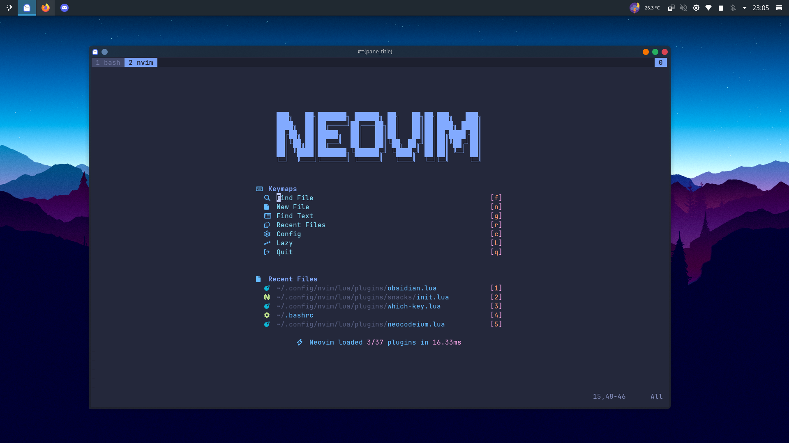
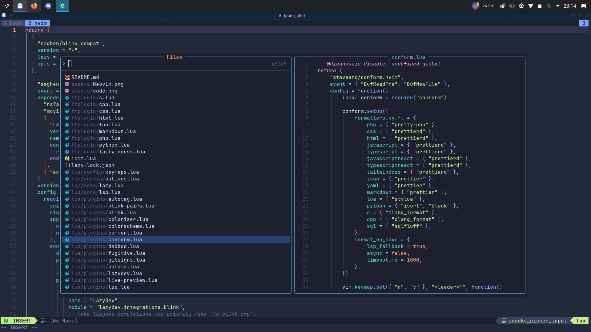
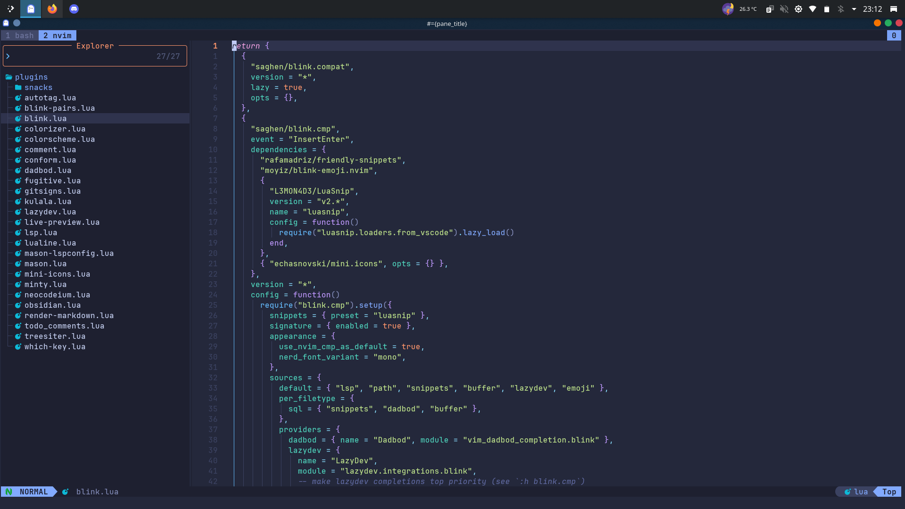

# 🐣 Neovim Configuration 🐤

# Description

This is my personal Neovim configuration, designed to be fast and efficient. Feel free to copy, modify, and adapt it for your own use.

# Preview





# Plugins

## Package Manager 📦

- [lazy.nvim ](https://github.com/folke/lazy.nvim)

## UI 👀

- [colorscheme](https://github.com/folke/tokyonight.nvim) _(Tokyonight)_
- [colorizer](https://github.com/norcalli/nvim-colorizer.lua)
- [lualine](https://github.com/nvim-lualine/lualine.nvim)
- [mini.icons](https://github.com/echasnovski/mini.icons)
- [render-markdown](https://github.com/MeanderingProgrammer/render-markdown.nvim)
- [snacks](https://github.com/folke/snacks.nvim)
- [treesiter](https://github.com/nvim-treesitter/nvim-treesitter)
- [treesiter-textobjects](https://github.com/nvim-treesitter/nvim-treesitter-textobjects)
- [oil](https://github.com/stevearc/oil.nvim?tab=readme-ov-file#requirements)
- [outline](https://github.com/hedyhli/outline.nvim)
- [smear-cursor](https://github.com/sphamba/smear-cursor.nvim)
- [screenkey](https://github.com/NStefan002/screenkey.nvim)

## LSP 📂

- [autopair](https://github.com/altermo/ultimate-autopair.nvim)
- [autotag](https://github.com/windwp/nvim-ts-autotag)
- [blink.cmp](https://github.com/saghen/blink.cmp)
- [blink.compat](https://github.com/Saghen/blink.compat)
- [blink-emoji](https://github.com/moyiz/blink-emoji.nvim)
- [conform](https://github.com/stevearc/conform.nvim)
- [friendly-snippets](https://github.com/rafamadriz/friendly-snippets)
- [lazydev](https://github.com/folke/lazydev.nvim)
- [luasnip](https://github.com/L3MON4D3/LuaSnip)
- [mason-lspconfig](https://github.com/mason-org/mason-lspconfig.nvim)
- [nvim-lspconfig](https://github.com/neovim/nvim-lspconfig)
- [neocodeium](https://github.com/monkoose/neocodeium)

## DB 📑

- [vim-dadbod](https://github.com/tpope/vim-dadbod)
- [vim-dadbod-ui](https://github.com/kristijanhusak/vim-dadbod-ui)
- [vim-dadbod-completion](https://github.com/kristijanhusak/vim-dadbod-completion)

## Git 😽

- [fugitive](https://github.com/tpope/vim-fugitive)
- [gitsigns](https://github.com/lewis6991/gitsigns.nvim)

## Tools 🧰

- [mini.comment](https://github.com/echasnovski/mini.comment)
- [nvim-ts-context-commentstring](https://github.com/JoosepAlviste/nvim-ts-context-commentstring)
- [fzf](https://github.com/ibhagwan/fzf-lua)
- [kulala](https://github.com/mistweaverco/kulala.nvim)
- [live-preview](https://github.com/brianhuster/live-preview.nvim)
- [mason](https://github.com/mason-org/mason.nvim)
- [minty](https://github.com/nvzone/minty)
- [obsidian](https://github.com/epwalsh/obsidian.nvim)
- [plenary](https://github.com/nvim-lua/plenary.nvim)
- [todo_comments](https://github.com/folke/todo-comments.nvim)
- [which-key](https://github.com/folke/which-key.nvim)

# How to install

## Requirements

- neovim >= v0.10
- git
- find files (fd or fd-find)
- live grep (ripgrep)
- nodejs
- npm
- Nerd Font 😎
- lazygit
- a C compiler for nvim-treesitter.
  - debian (build-essential)
  - arch (base-devel)
  - void (base-devel)
  - fedora ("Development Tools")
- imagemagick
- a terminal that support true color and undercurl:
  - kitty
  - ghostty
  - wezterm
  - alacritty
  - iterm2

## Make a backup of your current Neovim files:

```bash
# required
mv ~/.config/nvim{,.bak}

# optional but recommended
mv ~/.local/share/nvim{,.bak}
mv ~/.local/state/nvim{,.bak}
mv ~/.cache/nvim{,.bak}
```

## Clone the repository

    https://github.com/Alfr3si/nvim.git ~/.config/nvim

## Remove the .git folder, so you can add it to your own repo later

    rm -rf ~/.config/nvim/.git

## Start Neovim

    nvim
