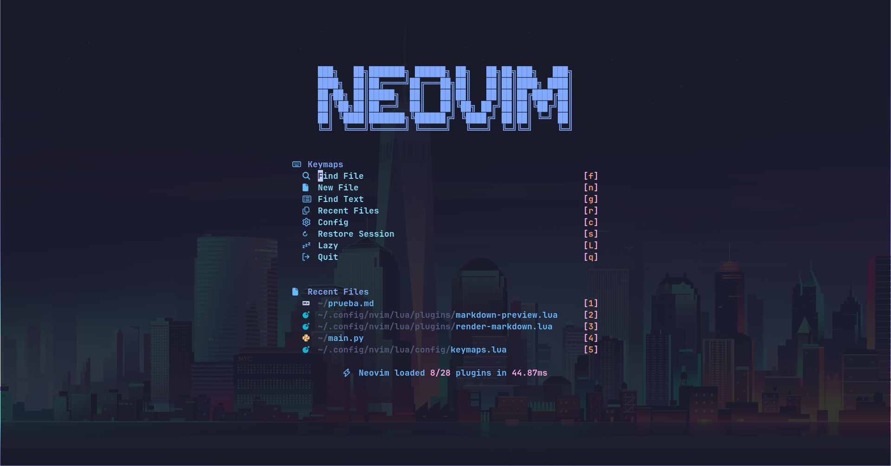
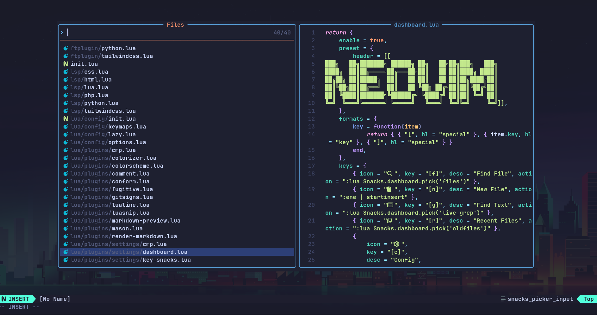
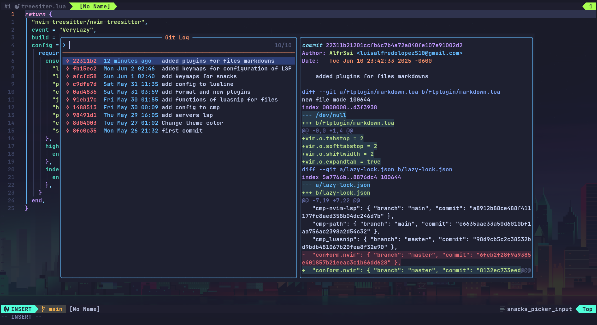

# Description

This repository was created and adapted for my workflow, but everyone interested is free to copy and modify it for their own use.

# Images

# plugins

- [cmp.lua](https://github.com/hrsh7th/nvim-cmp)
- [colorizer.lua](https://github.com/NvChad/nvim-colorizer.lua)
- [colorscheme.lua](https://github.com/folke/tokyonight.nvim) _(Tokyonight)_
- [comment.lua](https://github.com/numToStr/Comment.nvim)
- [conform.lua](https://github.com/stevearc/conform.nvim)
- [fugitive.lua](https://github.com/tpope/vim-fugitive)
- [gitsigns.lua](https://github.com/lewis6991/gitsigns.nvim)
- [lualine.lua](https://github.com/nvim-lualine/lualine.nvim)
- [luasnip.lua](https://github.com/L3MON4D3/LuaSnip)
- [markdown-preview.lua](https://github.com/iamcco/markdown-preview.nvim)
- [mason.lua](https://github.com/williamboman/mason.nvim)
- [render-markdown.lua](https://github.com/mehalter/markdown-render.nvim)
- [snacks.lua](https://github.com/catgoose/snacks.nvim)
- [todo_comments.lua](https://github.com/folke/todo-comments.nvim)
- [treesiter.lua](https://github.com/nvim-treesitter/nvim-treesitter)

# How to install

## Requeriments

- git
- lazy.nvim
- fzf or fd
- ripgrep
- nodejs

## clone the repository

    https://github.com/Alfr3si/nvim.git
